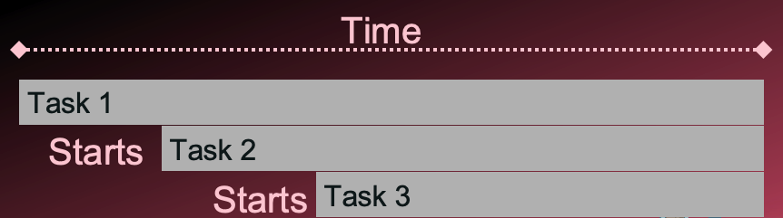
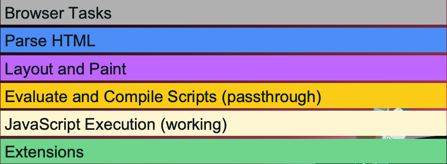
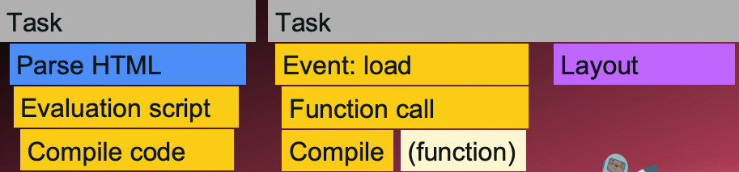

# 如何閱讀火焰圖（Flame Chart）

> 前幾篇介紹了 Core Web Vitals 的前兩個指標：LCP 與 CLS。在進入第三個指標 INP 之前，本篇先介紹另一個視覺化工具：火焰圖。它是理解 JavaScript 執行行為的關鍵，也是解讀 INP 的必要背景知識。

## 什麼是火焰圖

火焰圖（Flame Chart）是用來呈現瀏覽器在時間軸上執行哪些任務的圖表，通常與瀑布圖並排顯示，因為兩者量測的是不同維度的資訊：

- **瀑布圖**：呈現網路請求的時序
- **火焰圖**：呈現瀏覽器主執行緒上任務的執行細節

時間單位同樣是毫秒或微秒。

## 火焰圖的結構

火焰圖以**堆疊的橫條**來表示任務之間的呼叫關係。當一個任務（Task 1）觸發另一個任務（Task 2），Task 2 就顯示在 Task 1 的正下方；Task 2 再觸發 Task 3，Task 3 就在 Task 2 下方，以此類推。

以下面這段 JavaScript 為例：

```javascript
function task1() {
    task2();
}
function task2() {
    task3();
}
function task3() {
    /* something */
}
```



在火焰圖中會看到：

- Task 1 佔據最長的時間區間（因為它包含所有子任務）
- Task 2 從 Task 1 中間開始，比 Task 1 短
- Task 3 從 Task 2 中間開始，比 Task 2 短

**每個橫條的寬度代表這個任務佔用父任務多少時間**，越寬代表越耗時。

## 顏色

| 顏色   | 代表的任務類型                                          |
| ------ | ------------------------------------------------------- |
| 灰色   | 頂層瀏覽器任務（Task）                                  |
| 藍色   | 解析 HTML                                               |
| 紫色   | Layout 與 Paint 事件                                    |
| 深黃色 | 頂層 JavaScript（例如 evaluate script、compile script） |
| 淺黃色 | 實際的 JavaScript 執行（例如函式執行中的運算）          |
| 綠色   | 瀏覽器擴充功能，一般開發工作可忽略                      |



## 一個實際範例的執行順序

以下面這個簡單的 HTML 為例：

```html
<html>
    <body>
        <script>
            window.addEventListener('load', () => {
                var el = document.createElement('div');
                el.innerHTML = '<h1>Hey</h1>';
                document.body.appendChild(el);
            });
        </script>
    </body>
</html>
```

在火焰圖中，這段程式碼的執行過程大致如下：

1. **Task（灰色）**：HTML 下載完成後，瀏覽器建立一個頂層任務
2. **Parse HTML（藍色）**：解析 HTML，遇到 `<script>` 標籤
3. **Evaluation script / Compile code（深黃色）**：瀏覽器在這個階段只會讀取頂層的 JavaScript，發現有一個 `addEventListener`，將它登記起來，但不編譯也不執行函式內容
4. **Task（灰色）**：load 事件觸發後，建立新的頂層任務
5. **Event: load / Function call / Compile（淺黃色）**：瀏覽器這時才真正編譯並執行 callback 函式的內容
6. **Layout（粉紫色）**：`appendChild` 修改 DOM 後，觸發 layout 計算



## 為什麼火焰圖對效能分析重要

瀏覽器只有一條**主執行緒（main thread）**，它必須同時負責：

- 處理使用者事件（點擊、鍵盤輸入等）
- 計算 layout
- 執行 Paint
- 執行 JavaScript

這些任務全部排在同一條執行緒上，必須輪流進行。如果有一段 JavaScript 執行時間很長，就會**阻塞主執行緒**，讓其他任務無法進行，包括回應使用者的操作。這正是下一個指標 INP 所要量測的問題核心。

## 複習

### 什麼是火焰圖，它能幫助視覺化什麼？

火焰圖是一種視覺化工具，用來呈現瀏覽器執行任務的過程，通常以毫秒或微秒為單位，以堆疊橫條的方式呈現巢狀任務與各自的執行時間。

### 火焰圖中不同顏色分別代表什麼？

火焰圖中的顏色代表不同類型的瀏覽器任務：灰色為頂層瀏覽器任務，藍色為 HTML 解析，粉紫色為 layout 與 paint 事件，深黃色為頂層 JavaScript，淺黃色為實際的 JavaScript 執行。

### 瀏覽器主執行緒有什麼重要性？

主執行緒是唯一的執行緒，負責處理所有使用者事件、文件 layout、paint 以及 JavaScript 執行。緩慢的 JavaScript 會阻塞其他關鍵任務的執行，進而影響使用者體驗。

### 火焰圖中各任務之間的關係是什麼？

火焰圖中的任務以垂直堆疊方式呈現，顯示一個任務如何觸發並呼叫另一個任務。每個橫條的寬度代表該子任務佔用父任務多少時間。

### 在 HTML 解析過程中遇到 script 標籤時會發生什麼？

瀏覽器會先編譯頂層 JavaScript，識別其中的事件監聽器，並在對應事件（例如 load）觸發時，才編譯並執行該函式的內容。

## 小測驗

<details>
<summary>火焰圖中，頂層瀏覽器任務是什麼顏色？</summary>
灰色
</details>

<details>
<summary>火焰圖在網頁效能分析中為什麼重要？</summary>
它能視覺化主執行緒上瀏覽器任務的執行過程
</details>

<details>
<summary>火焰圖中，一個橫條的寬度通常代表什麼？</summary>
該子任務佔用父任務多少時間
</details>

<details>
<summary>瀏覽器中哪條執行緒負責 JavaScript 執行、使用者事件、layout 與 paint？</summary>
主執行緒
</details>

> 此文章是 [FrontendMasters](https://frontendmasters.com/) 上的 [Web Performance Fundamentals](https://frontendmasters.com/courses/web-perf-v2/) 課程筆記
