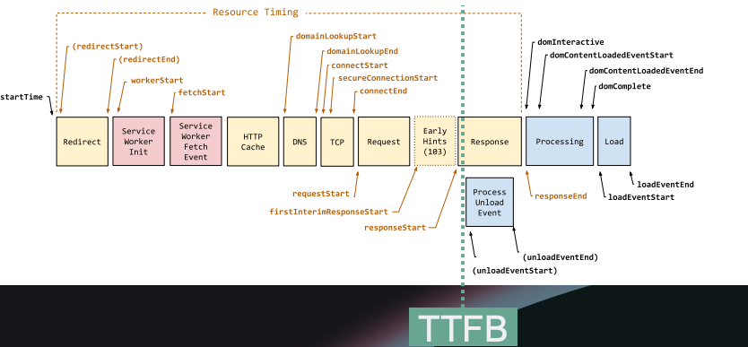

# 其他效能指標：TTFB（首位元組時間）

> 前幾篇完整介紹了 Core Web Vitals 的三個指標（LCP、CLS、INP）以及已退役的 FID。本篇進入課程的另一個補充指標：TTFB，它衡量的是伺服器與網路層面的效能，與前面幾個指標的關注點截然不同。

## 什麼是 TTFB

TTFB（Time to First Byte，首位元組時間）量測的是：從使用者發出請求，到瀏覽器收到伺服器回傳的第一個位元組，這中間花了多少時間。

這是所有效能指標中最偏向「基礎設施」的一個。它與客戶端的 HTML、JavaScript、CSS 完全無關，量測的純粹是**伺服器與網路的回應速度**：資料庫查詢多快、伺服器多快開始傳送資料、網路傳輸延遲多少。

## 收到第一個位元組之前發生了什麼

TTFB 看起來只是一個時間點，但在這之前其實發生了一連串事情。以使用者從 Google 搜尋結果點進一個網站為例：

1. **startTime**：使用者點擊連結，導航開始
2. **Redirect**：如果有轉址（例如 analytics tracker 轉到目標 URL），每一次轉址都計入時間
3. **Service Worker**：若網站有 Service Worker，瀏覽器會先經過這個階段（本課程不深入此主題）
4. **HTTP Cache**：瀏覽器檢查是否有本地快取可用
5. **DNS lookup**：查詢目標網域對應的 IP 位址
6. **TCP connection**：與伺服器建立連線
7. **Request**：送出 HTTP 請求
8. **Response（第一個位元組到達）**：這就是 TTFB 觸發的時刻

講師特別指出，**轉址會直接增加 TTFB**，過多的轉址會對效能造成實質影響。

## TTFB 與 LCP 的關係

TTFB 雖然不是 Core Web Vital，也不是 Google 搜尋排名的直接懲罰指標，但它會直接影響 LCP。如果伺服器遲遲無法送出第一個位元組，瀏覽器就無法開始解析 HTML、下載資源，自然也無法繪製頁面上最大的元素，LCP 必然延遲。

這是為什麼 TTFB 值得關注，即便它本身不在 Google 的排名懲罰範圍內。

## Google 的建議標準

Google 建議 TTFB 應在 **800 毫秒以內**，涵蓋所有轉址、網路跳躍、伺服器處理時間的總和。

講師坦言這個目標在現實中並不容易達到，尤其是需要進行資料庫查詢才能渲染頁面的公開網站。每一次資料庫呼叫都會消耗 TTFB 的時間預算，對公開網站來說，只要在渲染時需要進行資料庫查詢，就很難達到 800 毫秒的門檻。

## 複習

### TTFB（首位元組時間）主要量測什麼？

TTFB 量測主機回應請求的速度，聚焦於伺服器與網路效能，從瀏覽器收到伺服器回傳的第一個位元組那一刻開始計算。

### 在量測到 TTFB 之前，會經歷哪些關鍵步驟？

依序包含：導航開始、可能發生的轉址、Service Worker 處理、本地快取檢查、DNS 查詢、建立 TCP 連線，最後才向伺服器發出請求。

### TTFB 的建議基準值是多少？

TTFB 理想上應低於 800 毫秒，但對於渲染時需要資料庫查詢的網站而言，這個目標可能難以達到。

### TTFB 如何影響其他網頁效能指標？

TTFB 直接影響 LCP（最大內容繪製），因為伺服器回應緩慢會延遲頁面最大元素的渲染。

### TTFB 不量測哪些網頁效能面向？

TTFB 不量測客戶端的程式碼效能，包含 HTML、JavaScript 或 CSS 的渲染，它專注於伺服器與網路的回應速度。

## 小測驗

TTFB（首位元組時間）主要量測什麼？

伺服器與網路效能

根據課程內容，TTFB 的建議最大門檻是多少？

800 毫秒

在網站導航過程中，量測到 TTFB 之前會發生哪些步驟？

DNS 查詢、建立 TCP 連線，以及可能發生的轉址

TTFB 如何影響其他網頁效能指標？

它直接影響最大內容繪製（LCP）

量測到 TTFB 的那一刻發生了什麼事？

瀏覽器收到伺服器回傳的第一個位元組

> 此文章是 [FrontendMasters](https://frontendmasters.com/) 上的 [Web Performance Fundamentals](https://frontendmasters.com/courses/web-perf-v2/) 課程筆記
